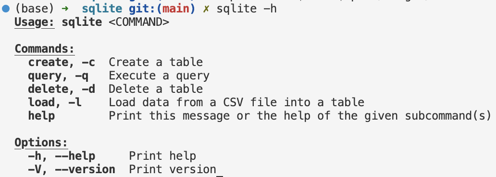
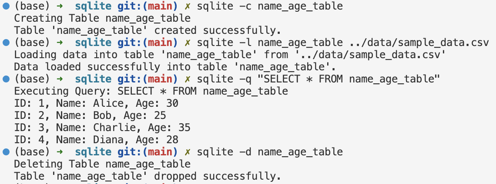
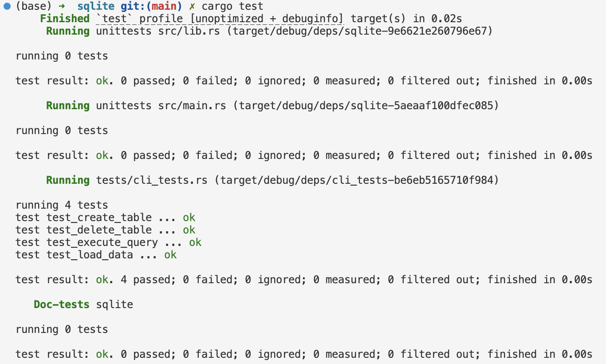

[](https://github.com/nogibjj/Ailina_Aniwan_Mini_Project_7/actions/workflows/CI.yml)
# IDS706 - Mini Project 7 - Ailina Aniwan

## Package a Command-Line Tool in Rust

## ✔️ Project Overview
This project is a Rust-based command-line tool for performing basic SQL operations (Create, Read, Load, and Delete) on a SQLite database. It provides a straightforward CLI interface, allowing users to manage tables and data through simple commands. The tool leverages Rust’s `clap` library for command-line argument parsing, `rusqlite` for database interaction, and `csv` for data loading.

## ✔️ Project Requirements
- Package a Python script with setuptools or a similar tool (We opted for Rust).
- Include communication with an external or internal database (SQLite in this case).
- Provide functionality and user guidance.

## ✔️ Functionality and User Guide
### Prerequisites
First, ensure your Rust environment is already set up. You can verify the installation by running:
```bash
cargo --version
```
### Dependencies
Run the following commands in your terminal to add necessary dependencies. These commands modify the Cargo.toml file to include required libraries:
```bash
cargo add clap --features derive
cargo add rusqlite
cargo add csv
```
### Building the Project
To compile and build the project, navigate to the project root directory and run:
```bash
cargo build --release
```
### Setting the Path
Export the release folder to your path so you can run the CLI commands directly from any location. Adjust the path to match your setup:
```bash
export PATH=$PATH:$(pwd)/target/release
```
### Using the Tool
This tool supports four main commands:
- **Create** (`-c`): Creates a new table.
- **Load** (`-l`): Loads data from a CSV file into a specified table.
- **Query** (`-q`): Executes an SQL query.
- **Delete** (`-d`): Deletes a specified table.

Each command can be accessed with both its full name and its short alias.

### Command Overview
For a quick overview of available commands, you can use:
```bash
sqlite -h
```

### Examples of Commands
To create a new table, use the `-c` flag:
```bash
sqlite -c name_age_table
```
To load data from a CSV file into the table, use the `-l` flag and specify the table name and file path:
```bash
sqlite -l name_age_table ../data/sample_data.csv
```
To execute a query on the table, use the `-q` flag:
```bash
sqlite -q "SELECT * FROM name_age_table"
```
To delete a table, use the `-d` flag:
```bash
sqlite -d name_age_table
```

### Testing
This project includes automated tests located in the tests/cli_tests.rs file. These tests verify the functionality of each command (Create, Load, Query, and Delete).

To run the tests, execute:
```bash
cargo test
```

